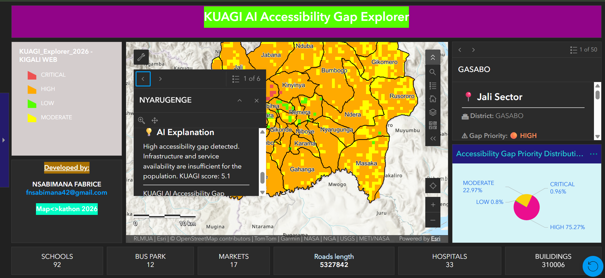

# KUAGI AI Accessibility Gap Explorer



## Map<>Kathon 2026 Project

**KUAGI (Kigali Urban Accessibility Gap Index)** is an AI-powered GIS dashboard developed to identify, visualize, and explain accessibility gaps across Kigali City, Rwanda.

The project combines **OpenStreetMap data, spatial analysis, GIS technology, and AI-assisted insights** to support data-driven urban planning and improve access to essential services.

---

# 🌍 Public Good Problem

Many urban communities experience unequal access to important services such as:

- 🏥 Health facilities
- 🏫 Schools
- 🛒 Markets
- 🚌 Public transport
- 🛣️ Road networks

Limited accessibility affects communities by increasing travel difficulties and reducing equal opportunities.

KUAGI helps identify areas where accessibility improvements should be prioritized.

---

# 🎯 Project Objectives

The project aims to:

- Identify areas with high accessibility gaps
- Support urban planners with spatial evidence
- Transform geographic data into actionable insights
- Improve understanding of service distribution across Kigali City

---

# 🚀 Main Features

## Interactive GIS Dashboard

The dashboard provides:

✅ District and sector exploration  
✅ Accessibility gap visualization  
✅ KUAGI score analysis  
✅ Population density information  
✅ Infrastructure indicators  
✅ AI-generated recommendations  

---

## 📊 Gap Priority Classification

Accessibility gaps are categorized into four levels:

| Priority | Score Range |
|----------|-------------|
| 🔴 Critical | 80 - 100 |
| 🟠 High | 60 - 79.99 |
| 🟡 Moderate | 40 - 59.99 |
| 🟢 Low | 0 - 39.99 |

Higher KUAGI scores represent areas requiring greater attention.

---

# 🗺️ OpenStreetMap Data Used

OpenStreetMap provides the geographic foundation of the project.

Data used includes:

- 🛣️ Roads and pathways
- 🏫 Educational facilities
- 🏥 Health facilities
- 🛒 Markets
- 🚌 Transport-related features
- 🏢 Urban infrastructure

OpenStreetMap was selected because it provides open, community-driven geographic data suitable for urban accessibility analysis.

---

# 🔬 Methodology

The workflow included:

### 1. Data Collection

OpenStreetMap data was collected and prepared for Kigali City analysis.

### 2. Spatial Analysis

GIS analysis was performed using accessibility indicators including:

- Service availability
- Population density
- Infrastructure distribution
- Connectivity

### 3. KUAGI Score Calculation

Indicators were combined to estimate accessibility gap levels.

### 4. Visualization

Results were displayed through an interactive ArcGIS dashboard.

### 5. AI Interpretation

AI was used to generate understandable explanations and possible planning actions.

---

# 🛠️ Tools Used

## GIS & Mapping

- ArcGIS Online
- ArcGIS Dashboards
- ArcGIS Map Viewer
- ArcGIS Arcade
- QGIS

## OpenStreetMap Tools

- Overpass Turbo
- OpenStreetMap data services

## Development & AI

- Python
- ChatGPT
- AI-assisted documentation and analysis

---

# 🤖 AI Usage

AI supported the project by helping with:

- Arcade expression development
- Dashboard popup design
- Documentation writing
- User-friendly explanations
- Accessibility recommendations

AI outputs were reviewed and validated against GIS results.

No AI-generated edits were directly added to OpenStreetMap.

---

# 📌 Dashboard

View the interactive dashboard:

https://www.arcgis.com/apps/dashboards/839b1f0dff3c48a2bfbad9e406a1dea9

---

# 📁 Repository Contents

```
KUAGI AI Accessibility Gap Explorer

├── README.md
├── AI_USAGE.md
├── links.md
├── methodology.md
├── KUAGI_Project_Documentation.md
└── dashboard-screenshot.png
```

---

# 👨‍💻 Developer

**NSABIMANA Fabrice**

Map<>Kathon 2026 Submission

Country: Rwanda

---

# 📚 Data Attribution

© OpenStreetMap contributors

OpenStreetMap data is available under the Open Database License (ODbL).

https://www.openstreetmap.org/copyright

---

# 🏆 Project Vision

KUAGI demonstrates how open geographic data and artificial intelligence can work together to support smarter, more inclusive, and evidence-based urban development.
